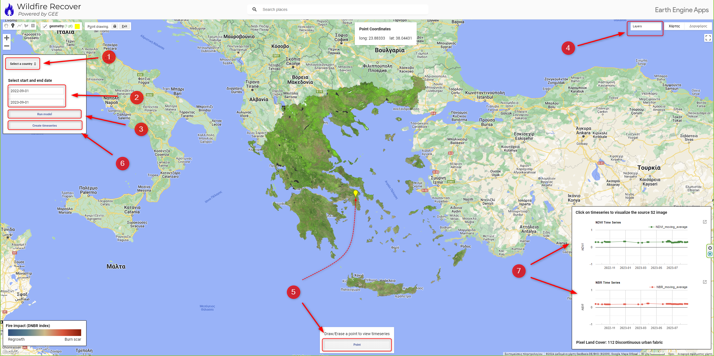

# Wildfire Recovery Application - [Link](https://ee-my-username32blue.projects.earthengine.app/view/wildfire-recover)

This repository contains the web-based application "Wildfire Impact" for analyzing the recovery of wildfire affected areas using Google Earth Engine and Google Earth Engine's user interface (UI). Harnessing the power of Google Earth Engine, the "Wildfire Impact" application is designed to visualize, identify, and calculate the recovery from wildfires worldwide from Sentinel-2 images, in a matter of seconds.

### Click on the following image to view a brief demo of the application

### Development team: 
[Minas Chatzigeorgiadis](https://www.linkedin.com/in/minas-chatz/), [Dr Thanos Doganis](https://www.linkedin.com/in/thanos-doganis-41550915/) and [Io Dogani](https://www.linkedin.com/in/dogani-io/), GIS Lab research team of [MSc Climate ICT](https://masters.ds.unipi.gr/MSc_Climate_ICT/en/) of [University of Piraeus](https://www.unipi.gr/unipi/en/)
_______________________________________________________________________________________________________________________________________________________________________________________________________________________________________________________________________________________________________________________________

## Summary

Explore the recovery after wildfires using the "Wildfire Recovery" application tool which allows you to:

- **Input Parameters**: Define date ranges for reference and curent satellite imagery to analyze the recovery of forest areas within specific timeframes.

- **Pont of Interest (POI)**: Easily create POIs using intuitive drawing tools for precise analysis of wildfire recovery in chosen regions.

- **Wildire Recovbery Classification**: The tool calculates the dNBR index to visualize regrowth of burn scar.

- **Timeseries charts**: The application creates interactive timeseries charts for NBRI and NDVI to estimete the POI recovery from wildfire.

- **Download charts as CSV**: The applications enables the indices timeseries export as CSV files

## How It Works

The tool operates in two steps:

1. **Data Collection and Visualize Impact**: Select the country of interest and specify the curen and reference image collection periods. The tool uses this data to calculate the NBR and NDV index, identifying areas recovering from wildfires.

2. **POI Analysis**: Define an POI, and the tool provides NBR and NDVI timeseries statistics identifing the user for the land cover of the POI from Corine 2018 (For EU).

Whether you're a researcher, land manager, or concerned citizen, the Wildfire Recovery Analysis Tool offers a powerful and accessible way to assess the recovery from wildfires and make informed decisions based on satellite data.

## Table of Contents

- [Model Workflow](#model-workflow)
- [POI Impact Analysis](#poi-impact-analysis)

## Model Workflow

The workflow to run the visualization model:

- **Step 1:** Define the country you are interested to calculate the wildfire impact from the dropdown list
- **Step 2:** Difine the start and end dates you want to calculate the timeseries. The start and end dates must be inputed in the form of yyyy-mm-dd (eg. 2023-09-01)
- **Step 3:** Press "Run model" button
- **Step 4:** Browse through the layers from the 'layers' option.
   The model produces 4 layers on the map:
  - DNBR Index that visualizes possible burn areas in red and regrothing areas with blue.
  - Reference SWIR-NIR-Red Band combination that enables rapid visualization of burn scars and identification of cloud coverage.
  - Curent  that enables burn scar comparisons and identification of cloud coverage.
  - Corine 2018 (For EU)

## POI Impact Analysis

The Wildfire Recovery application enables for furter analysis of user defined Proint Of Interst (POI). To asses the wildfire recovery for specific regions:

- **Step 5:** Define the POI from the custom Drawing Tools. Click on "Point" button and draw on the map to specify the POI. Click a second time on the "Point" button to reset the point geometry an define a defferent POI. Coordinates of POI will appear on screen after the next step.
- **Step 6:** Click on the "Create timeseries" button
- **Step 7:** The timeseries results will pop up
    - DNBR timeseries chart for POI
    - NDVI timeseries chart for POI
    - Info for the land cover of POI (for EU)
 - > Click on timeseries to import the source Image on the map and explore SWIR-NIR-Red Band combination
 - > Use the pan icon (small hand icon on the top left) to exit drawing mode and navigate on the map
 - > Expand the chart from top right icon (on the chart) and use the download CSV option to export the chart CSV file.

